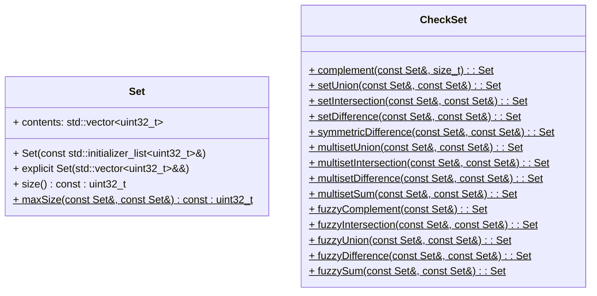

```mermaid
classDiagram
    class Set {
        + Set(const std::initializer_list~uint32_t~&)
        + explicit Set(std::vector~uint32_t~&&)
        + size() const : uint32_t
        + maxSize(const Set&, const Set&) const : uint32_t$
        
        + contents: std::vector~uint32_t~
    }
    
    class CheckSet {
        + complement(const Set&, size_t) : Set $
        + setUnion(const Set&, const Set&) : Set $
        + setIntersection(const Set&, const Set&) : Set $
        + setDifference(const Set&, const Set&) : Set $
        + symmetricDifference(const Set&, const Set&) : Set $
        + multisetUnion(const Set&, const Set&) : Set $
        + multisetIntersection(const Set&, const Set&) : Set $
        + multisetDifference(const Set&, const Set&) : Set $
        + multisetSum(const Set&, const Set&) : Set $
        + fuzzyComplement(const Set&) : Set $
        + fuzzyIntersection(const Set&, const Set&) : Set $
        + fuzzyUnion(const Set&, const Set&) : Set $
        + fuzzyDifference(const Set&, const Set&) : Set $
        + fuzzySum(const Set&, const Set&) : Set $
    }
```